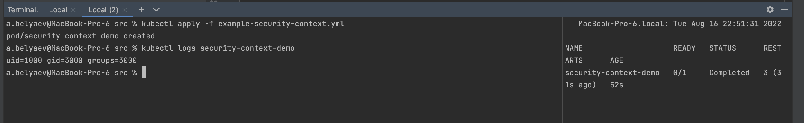
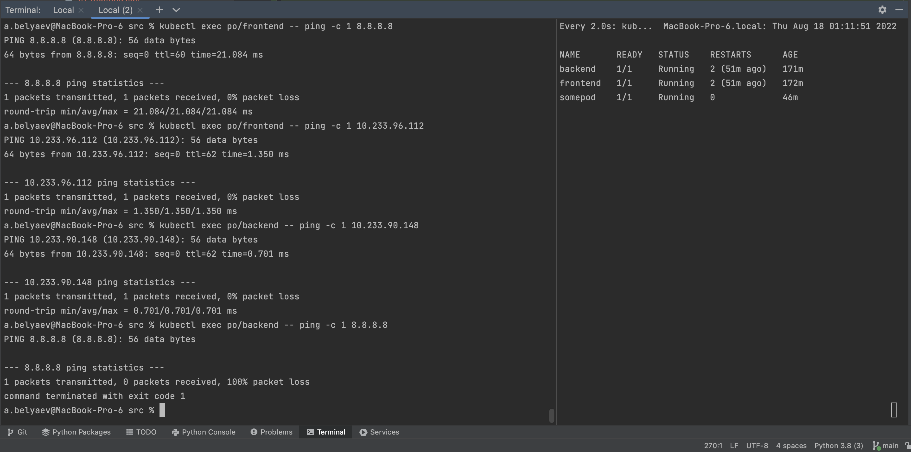

# Домашнее задание к занятию "14.5 SecurityContext, NetworkPolicies"

## Задача 1: Рассмотрите пример 14.5/example-security-context.yml

Создайте модуль [example-security-context.yml](src/example-security-context.yml)

```
kubectl apply -f 14.5/example-security-context.yml
```

Проверьте установленные настройки внутри контейнера  

```
kubectl logs security-context-demo
uid=1000 gid=3000 groups=3000
```

Под запустился, id текущего пользователя в контейнере 1000, группа 3000.

## Задача 2 (*): Рассмотрите пример 14.5/example-network-policy.yml

Создайте два модуля. Для первого модуля разрешите доступ к внешнему миру
и ко второму контейнеру. Для второго модуля разрешите связь только с
первым контейнером. Проверьте корректность настроек.  

Запустим поды [fronend](src/pods/frontend.yml), [backend](src/pods/backend.yml) 
Проверим что пинги идут  
```shell
# Узнаем их айпи
% kubectl get po/frontend -o json | jq -c '.status.podIPs'
[{"ip":"10.233.90.148"}]
% kubectl get po/backend -o json | jq -c '.status.podIPs' 
[{"ip":"10.233.96.112"}]

# Проверим связь между ними
% kubectl exec po/frontend -- ping -c 1 10.233.96.112    
PING 10.233.96.112 (10.233.96.112): 56 data bytes
64 bytes from 10.233.96.112: seq=0 ttl=62 time=1.221 ms
--- 10.233.96.112 ping statistics ---
1 packets transmitted, 1 packets received, 0% packet loss
round-trip min/avg/max = 1.221/1.221/1.221 ms

% kubectl exec po/backend -- ping -c 1 10.233.90.148 
PING 10.233.90.148 (10.233.90.148): 56 data bytes
64 bytes from 10.233.90.148: seq=0 ttl=62 time=2.176 ms
--- 10.233.90.148 ping statistics ---
1 packets transmitted, 1 packets received, 0% packet loss
round-trip min/avg/max = 2.176/2.176/2.176 ms

# Проверим связь с внешним миром
% kubectl exec po/frontend -- ping -c 1 8.8.8.8      
PING 8.8.8.8 (8.8.8.8): 56 data bytes
64 bytes from 8.8.8.8: seq=0 ttl=60 time=22.504 ms
--- 8.8.8.8 ping statistics ---
1 packets transmitted, 1 packets received, 0% packet loss
round-trip min/avg/max = 22.504/22.504/22.504 ms

% kubectl exec po/backend -- ping -c 1 8.8.8.8      
PING 8.8.8.8 (8.8.8.8): 56 data bytes
64 bytes from 8.8.8.8: seq=0 ttl=60 time=23.808 ms
--- 8.8.8.8 ping statistics ---
1 packets transmitted, 1 packets received, 0% packet loss
round-trip min/avg/max = 23.808/23.808/23.808 ms
```
Применим политику запрещающую весь входящий и исходящий трафик [00-default.yml](src/network-policy/00-default.yml)
```yaml
---
apiVersion: networking.k8s.io/v1
kind: NetworkPolicy
metadata:
  name: default-deny-all
spec:
  podSelector: {}
  policyTypes:
  - Ingress
  - Egress
```
Проверим  
```shell
# Применяем политику
% kubectl apply -f network-policy/00-default.yml 
networkpolicy.networking.k8s.io/default-deny-all created

# Пингуем внешку
% kubectl exec po/backend -- ping -c 1 8.8.8.8  
PING 8.8.8.8 (8.8.8.8): 56 data bytes
--- 8.8.8.8 ping statistics ---
1 packets transmitted, 0 packets received, 100% packet loss
command terminated with exit code 1

% kubectl exec po/frontend -- ping -c 1 8.8.8.8
PING 8.8.8.8 (8.8.8.8): 56 data bytes
--- 8.8.8.8 ping statistics ---
1 packets transmitted, 0 packets received, 100% packet loss
command terminated with exit code 1

# Между подами
% kubectl exec po/frontend -- ping -c 1 10.233.96.112
PING 10.233.96.112 (10.233.96.112): 56 data bytes
--- 10.233.96.112 ping statistics ---
1 packets transmitted, 0 packets received, 100% packet loss
command terminated with exit code 1

% kubectl exec po/backend -- ping -c 1 10.233.90.148
PING 10.233.90.148 (10.233.90.148): 56 data bytes
--- 10.233.90.148 ping statistics ---
1 packets transmitted, 0 packets received, 100% packet loss
command terminated with exit code 1
```
Доступа нет ни у кого никуда.  
Для модуля `frontend` разрешим доступ в инетернет, без доступа в кластер манифестом [10-frontend-inetaccess.yml](src/network-policy/10-frontend-inetaccess.yml)  
```yaml
apiVersion: networking.k8s.io/v1
kind: NetworkPolicy
metadata:
  name: access-to-inet-frontend
spec:
  podSelector:
    matchLabels:
      role: frontend
  policyTypes:
    - Egress
  egress:
    - to:
        - ipBlock:
            cidr: 0.0.0.0/0
            except:
              - 10.233.64.0/18    # Пул кластера, удобно узнать с помощью calicoctl get ipPool -o wide
              - 192.168.99.0/24   # IP нод удобно, узнать с помощью calicoctl get node -o wide
```
Проверка:  
```shell
# Применяем
% kubectl apply -f network-policy/10-frontend-inetaccess.yml 
networkpolicy.networking.k8s.io/access-to-inet-frontend created

# Доступ в инет появился у fronend
% kubectl exec po/frontend -- ping -c 1 8.8.8.8             
PING 8.8.8.8 (8.8.8.8): 56 data bytes
64 bytes from 8.8.8.8: seq=0 ttl=60 time=22.358 ms
--- 8.8.8.8 ping statistics ---
1 packets transmitted, 1 packets received, 0% packet loss
round-trip min/avg/max = 22.358/22.358/22.358 ms

# У второго пода доступа в инет нет
% kubectl exec po/backend -- ping -c 1 8.8.8.8      
PING 8.8.8.8 (8.8.8.8): 56 data bytes
--- 8.8.8.8 ping statistics ---
1 packets transmitted, 0 packets received, 100% packet loss
command terminated with exit code 1

# И все еще нет связи между подами
% kubectl exec po/frontend -- ping -c 1 10.233.96.112
PING 10.233.96.112 (10.233.96.112): 56 data bytes
--- 10.233.96.112 ping statistics ---
1 packets transmitted, 0 packets received, 100% packet loss
command terminated with exit code 1
```
Сделаем связь между `frontend` и `backend`.  
На стороне фронтэнда разрешим входящий и исходящий доступ на бэкэнд [20-frontend.yml](src/network-policy/20-frontend.yml)  
```yaml
apiVersion: networking.k8s.io/v1
kind: NetworkPolicy
metadata:
  name: access-for-frontend
spec:
  podSelector:
    matchLabels:
      role: frontend
  policyTypes:
    - Ingress
    - Egress
  ingress:
    - from:
        - ipBlock:
            cidr: 10.233.96.112/32
  egress:
    - to:
        - ipBlock:
            cidr: 10.233.96.112/32
```
На стороне бекэнда, входящий и исходящий к фронтэнду [30-backend.yml](src/network-policy/30-backend.yml)  
```yaml
apiVersion: networking.k8s.io/v1
kind: NetworkPolicy
metadata:
  name: access-for-backend
spec:
  podSelector:
    matchLabels:
      role: backend
  policyTypes:
    - Ingress
    - Egress
  ingress:
    - from:
      - ipBlock:
          cidr: 10.233.90.148/32
  egress:
    - to:
      - ipBlock:
          cidr: 10.233.90.148/32
```
Проверка  
```shell
# Применение правил
% kubectl apply -f network-policy/20-frontend.yml 
networkpolicy.networking.k8s.io/access-for-frontend created
% kubectl apply -f network-policy/30-backend.yml 
networkpolicy.networking.k8s.io/access-for-backend created

#  Свящь между frontend и backend появилась
% kubectl exec po/frontend -- ping -c 1 10.233.96.112  
PING 10.233.96.112 (10.233.96.112): 56 data bytes
64 bytes from 10.233.96.112: seq=0 ttl=62 time=1.517 ms
--- 10.233.96.112 ping statistics ---
1 packets transmitted, 1 packets received, 0% packet loss
round-trip min/avg/max = 1.517/1.517/1.517 ms

% kubectl exec po/backend -- ping -c 1 10.233.90.148 
PING 10.233.90.148 (10.233.90.148): 56 data bytes
64 bytes from 10.233.90.148: seq=0 ttl=62 time=1.167 ms
--- 10.233.90.148 ping statistics ---
1 packets transmitted, 1 packets received, 0% packet loss
round-trip min/avg/max = 1.167/1.167/1.167 ms

# Доступа в инет с backend по прежнему нет
% kubectl exec po/backend -- ping -c 1 8.8.8.8       
PING 8.8.8.8 (8.8.8.8): 56 data bytes
--- 8.8.8.8 ping statistics ---
1 packets transmitted, 0 packets received, 100% packet loss
command terminated with exit code 1

# Доступа у третьего пода нет никуда
% kubectl exec po/somepod -- ping -c 1 10.233.90.148
PING 10.233.90.148 (10.233.90.148): 56 data bytes
--- 10.233.90.148 ping statistics ---
1 packets transmitted, 0 packets received, 100% packet loss
command terminated with exit code 1

% kubectl exec po/somepod -- ping -c 1 10.233.96.112
PING 10.233.96.112 (10.233.96.112): 56 data bytes
--- 10.233.96.112 ping statistics ---
1 packets transmitted, 0 packets received, 100% packet loss
command terminated with exit code 1

% kubectl exec po/somepod -- ping -c 1 8.8.8.8      
PING 8.8.8.8 (8.8.8.8): 56 data bytes
--- 8.8.8.8 ping statistics ---
1 packets transmitted, 0 packets received, 100% packet loss
command terminated with exit code 1
```
