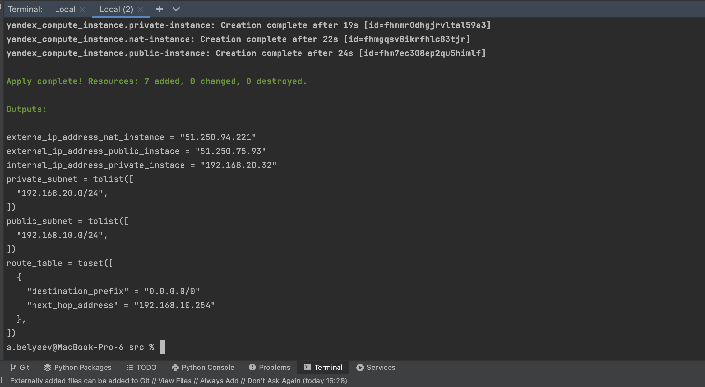
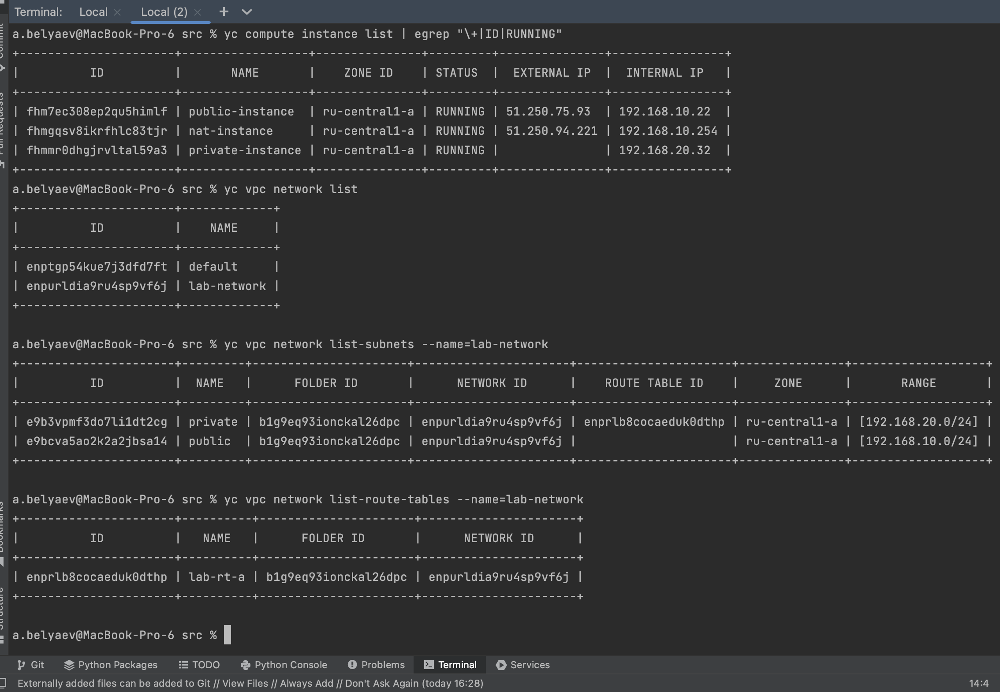
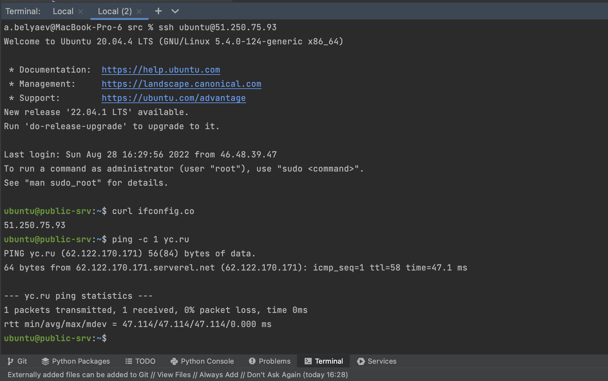
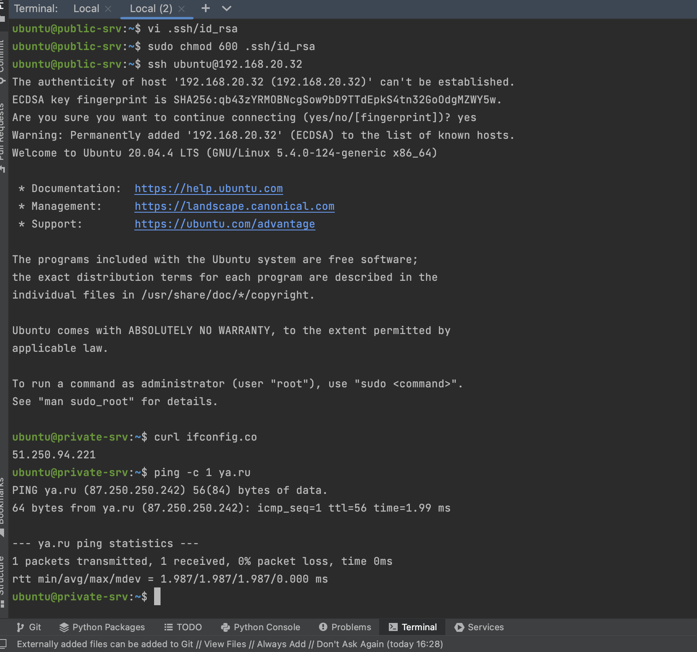

# 15.1. Организация сети  

## Задание 1. Яндекс.Облако (обязательное к выполнению)

1. Создать VPC.
- Создать пустую VPC. Выбрать зону.
  ```terraform
  resource "yandex_vpc_network" "lab-net" {
    name = "lab-network"
  }
  ```
2. Публичная подсеть.
- Создать в vpc subnet с названием public, сетью 192.168.10.0/24.
  ```terraform
  resource "yandex_vpc_subnet" "public" {
    v4_cidr_blocks = ["192.168.10.0/24"]
    zone           = "ru-central1-a"
    name           = "public"
    network_id     = yandex_vpc_network.lab-net.id
  }
  ```
- Создать в этой подсети NAT-инстанс, присвоив ему адрес 192.168.10.254. В качестве image_id использовать fd80mrhj8fl2oe87o4e1
  ```terraform
  resource "yandex_compute_instance" "nat-instance" {
    name                      = "nat-instance"
    platform_id               = "standard-v1"
    zone                      = "ru-central1-a"
    hostname                  = "nat-srv"
    allow_stopping_for_update = true
  
    resources {
      cores  = 2
      memory = 4
    }
  
    boot_disk {
      initialize_params {
        image_id = "fd8josjq21d56924jfan"
        size     = 30
        type     = "network-ssd"
      }
    }
  
    network_interface {
      subnet_id  = yandex_vpc_subnet.public.id
      ip_address = "192.168.10.254"
      nat        = true
    }
  
    metadata = {
      ssh-keys = "ubuntu:${file("~/.ssh/id_rsa.pub")}"
    }
  }
  ```
- Создать в этой публичной подсети виртуалку с публичным IP и подключиться к ней, убедиться что есть доступ к интернету.
  ```terraform
  # Тоже самое, что и в коде выше. Меняем только имя, хостнайм, image_id, а внутренний айпи назначится автоматически
    network_interface {
      subnet_id = yandex_vpc_subnet.public.id
      nat       = true
    }
  ```
3. Приватная подсеть.
- Создать в vpc subnet с названием private, сетью 192.168.20.0/24.
  ```terraform
  resource "yandex_vpc_subnet" "private" {
    v4_cidr_blocks = ["192.168.20.0/24"]
    zone           = "ru-central1-a"
    name           = "private"
    network_id     = yandex_vpc_network.lab-net.id
    route_table_id = yandex_vpc_route_table.lab-rt-a.id # Зацепил маршрут указнный ниже
  }
  ```
- Создать route table. Добавить статический маршрут, направляющий весь исходящий трафик private сети в NAT-инстанс
  ```terraform
  resource "yandex_vpc_route_table" "lab-rt-a" {
    network_id = yandex_vpc_network.lab-net.id
    name       = "lab-rt-a"
  
    static_route {
      destination_prefix = "0.0.0.0/0"
      next_hop_address   = "192.168.10.254"
    }
  }
  ```
- Создать в этой приватной подсети виртуалку с внутренним IP, подключиться к ней через виртуалку, созданную ранее и убедиться что есть доступ к интернету
  ```terraform
  # Для этой виртуалки указываем private подсеть и не включаем nat
    network_interface {
      subnet_id = yandex_vpc_subnet.private.id
    }
  ```

Все исходники лежат [здесь](src)  
Для удобства, код разбит на разные файлы, названия которых соответсвуют их сути.  
- provider.tf - установки провайдера Yandex Cloud
- network.tf - сеть
- nat-instance.tf (public-instance.tf, private-instace.tf) - виртуальная машина
- output.tf - вывод информации, IP адреса инстансов, подсети, маршрут  

### Шаги создания ресурсов  
Инициализация, установка провайдера в директории с исходниками:  
```shell
terraform init
```
Планирование ресурсов:  
```shell
terraform plan
```
Создание ресурсов:  
```shell
terraform apply -auto-approve
```
Удаление ресурсов:  
```shell
terraform destroy -auto-approve
```
### Результаты выполнения  

Создание ресурсов  

  

Проверка ресурсов  

  

Проверка public инстанса  

  

Проверка private инстанса  

  

В последнем скриншоте видно, что команда `curl` вернула внешний IP nat инстанса, т.е. трафик идет через него.  
