# 15.2 "Вычислительные мощности. Балансировщики нагрузки".  

## Задание 1. Яндекс.Облако (обязательное к выполнению)

1. Создать bucket Object Storage и разместить там файл с картинкой:
- Создать bucket в Object Storage с произвольным именем (например, _имя_студента_дата_);
- Положить в bucket файл с картинкой;
- Сделать файл доступным из Интернет.

  Для публичного доступа к файлу используется `acl = "public-read"` объекта.  
  Результат в файле [storage.tf](src/storage.tf)
2. Создать группу ВМ в public подсети фиксированного размера с шаблоном LAMP и web-страничкой, содержащей ссылку на картинку из bucket:
- Создать Instance Group с 3 ВМ и шаблоном LAMP. Для LAMP рекомендуется использовать `image_id = fd827b91d99psvq5fjit`;
- Для создания стартовой веб-страницы рекомендуется использовать раздел `user_data` в [meta_data](https://cloud.yandex.ru/docs/compute/concepts/vm-metadata);
- Разместить в стартовой веб-странице шаблонной ВМ ссылку на картинку из bucket;
- Настроить проверку состояния ВМ.
  
  Для проверики состояния используется `health_check`.  
  Результат в файле [instance-group.tf](src/instance-group.tf)
3. Подключить группу к сетевому балансировщику:
- Создать сетевой балансировщик;
- Проверить работоспособность, удалив одну или несколько ВМ.

  Для создания таргет группы используется блок `load_balancer` в манифесте из предыдущего шага [instance-group.tf](src/instance-group.tf#L70).  
  Далее прикрепляем эту группу в блоке `attached_target_group` сетевого балансировщика.  
  Результат в файле [balance.tf](src/balancer.tf).  
4. *Создать Application Load Balancer с использованием Instance group и проверкой состояния.
  
   Здесь примерно тоже самое, только для таргет группы, вместо `load_balancer` делаем `application_load_balancer` в группе ВМ [instance-group-alb.tf](src/instance-group-alb.tf#L69). Сделаем отдельную группу ВМ для ALB.  
   ```terraform
   application_load_balancer {
     target_group_name        = "target-group-alb"
     target_group_description = "application load balancer target group"
   }
   ```
   Далее нам нужно создать ресурсы `yandex_alb_backend_group`, `yandex_alb_http_router` и сам балансировщик `yandex_alb_load_balancer`. Все три сущности разметил в одном файле [app-balancer.tf](src/app-balancer.tf).  
   Проверка ALB ниже, после проверки NLB.  

Все исходники находятся [здесь](src).
### Проверяем Network Load Balancer.  
```shell
 % terraform apply -auto-approve
yandex_iam_service_account.sa: Refreshing state... [id=aje9miuilvh4mjqpiopb]
yandex_iam_service_account.ig-sa: Refreshing state... [id=ajete5v3re4t0hm2favg]
yandex_vpc_network.lab-net: Refreshing state... [id=enp5q8v3i31s5thjfh3p]
.....
.....
.....
yandex_compute_instance_group.ig-1: Creation complete after 1m37s [id=cl1odcb8t7qde1fch88c]
yandex_lb_network_load_balancer.foo: Creating...
yandex_lb_network_load_balancer.foo: Creation complete after 3s [id=enp73t1j28oudqibdhd8]

Apply complete! Resources: 2 added, 0 changed, 0 destroyed.

Outputs:

address_lb = toset([
  {
    "external_address_spec" = toset([
      {
        "address" = "130.193.38.59"
        "ip_version" = "ipv4"
      },
    ])
    "internal_address_spec" = toset([])
    "name" = "my-listener"
    "port" = 80
    "protocol" = "tcp"
    "target_port" = 80
  },
])
```
Смотрим что группа ВМ запустилось.  

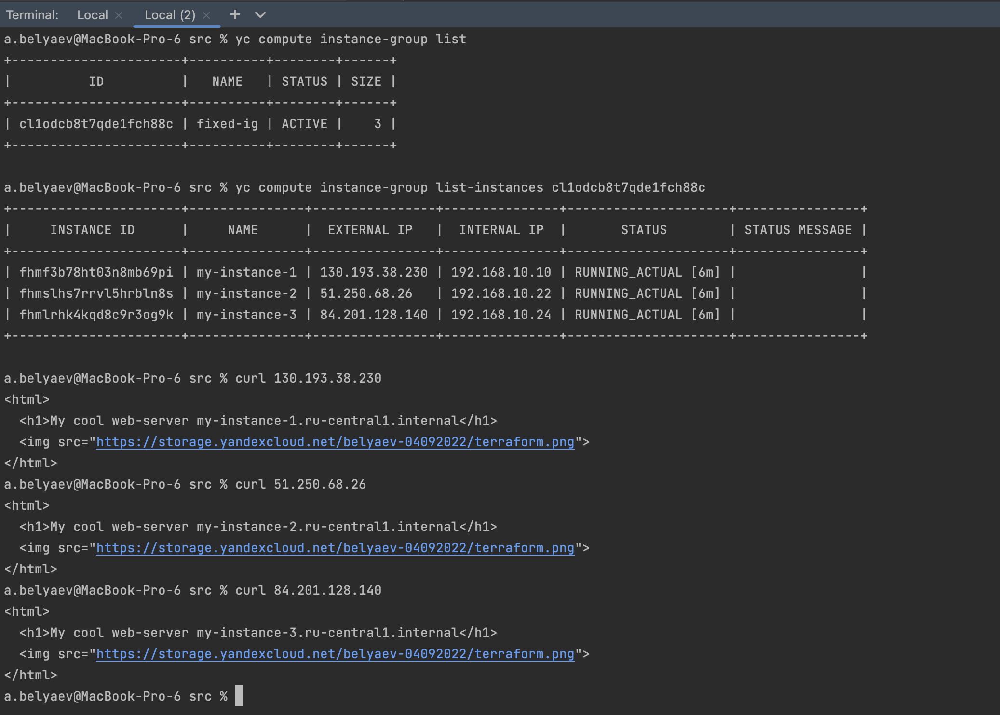
Смотрим сетевой балансировщик.  

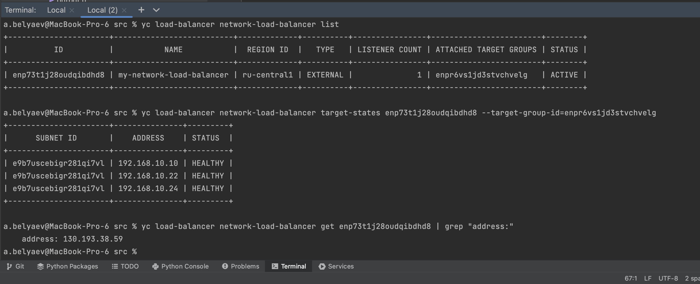  

Проверим балансировщик. С помощью `watch` будем каждые 2 секунды обращаться к балансировщику и наблюдать как меняется имя хотса в заголовке, т.е. наш балансировщик распределяет трафик по всем трем хостам.  

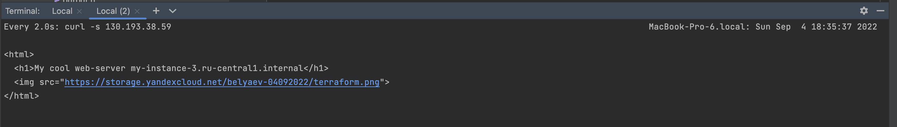
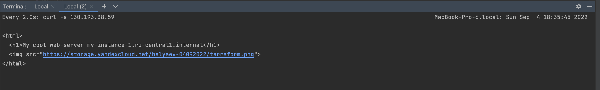
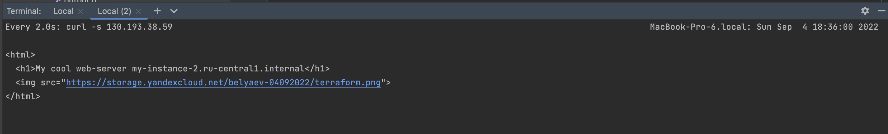
Проверим через браузер.
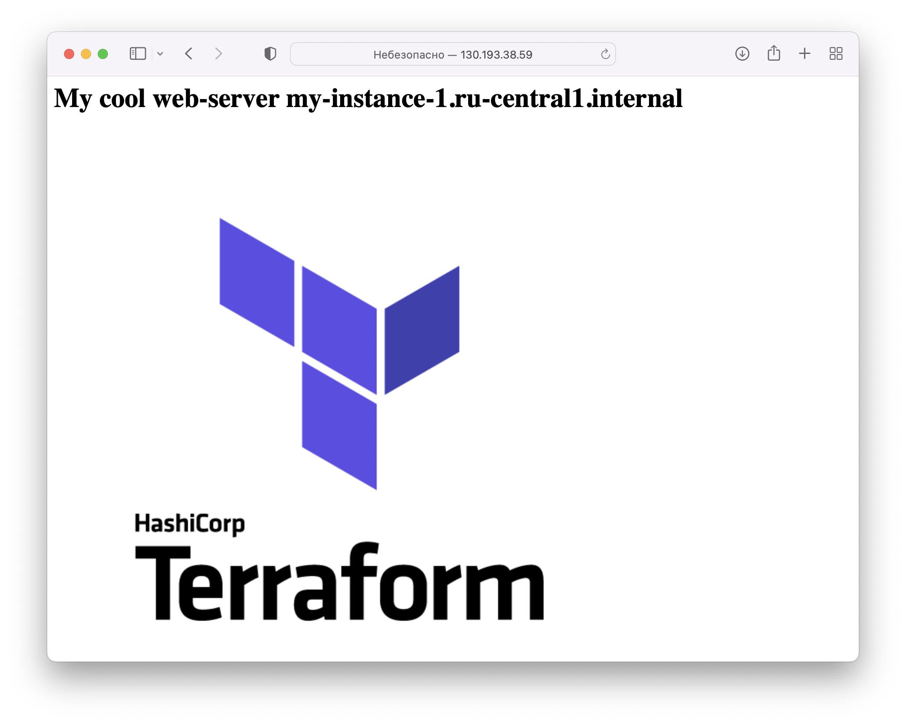
Остановим один инстанс и проверим открывается ли страница.  

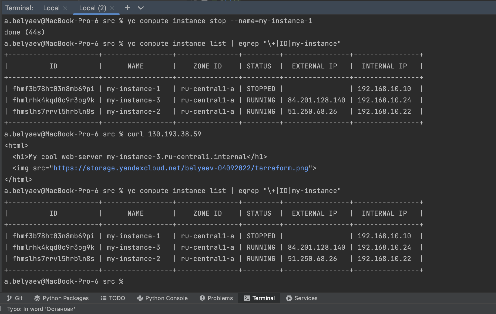
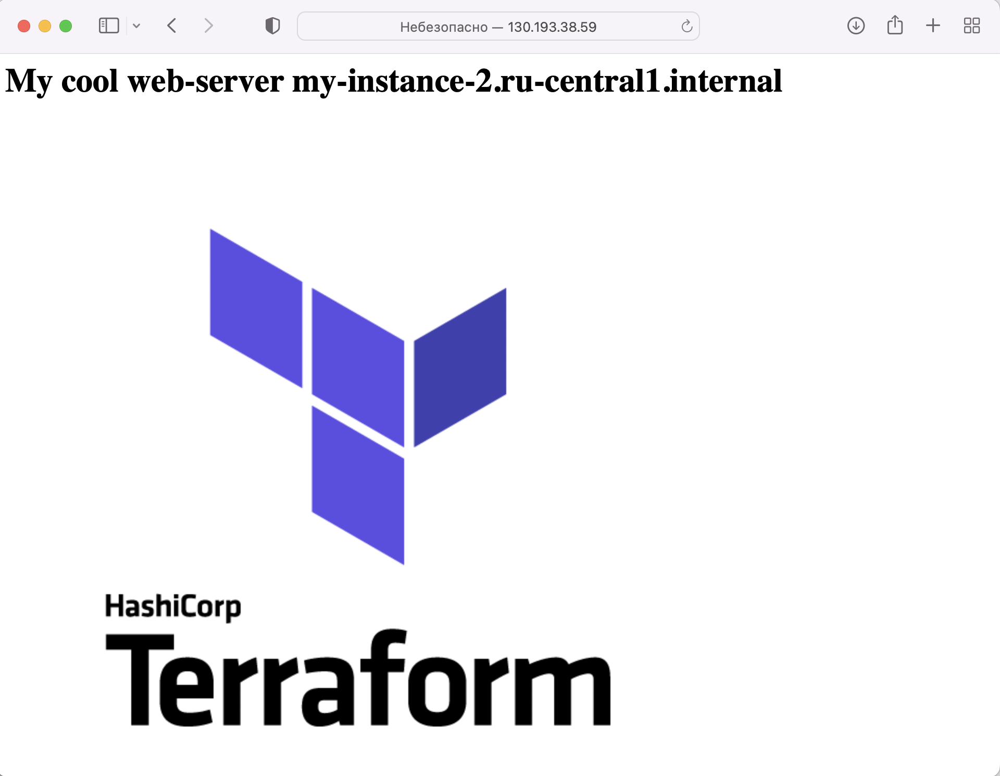  

### Проверяем Application Load Balancer  
Завершение `terraform apply` без ошибок.  

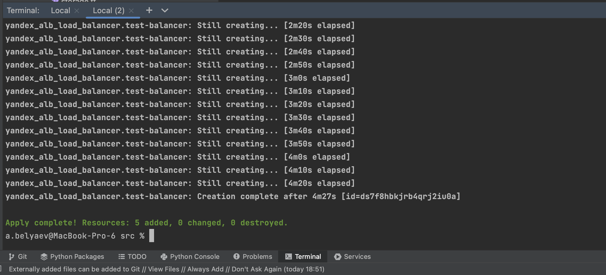  

Проверим созданные объекты в браузере.
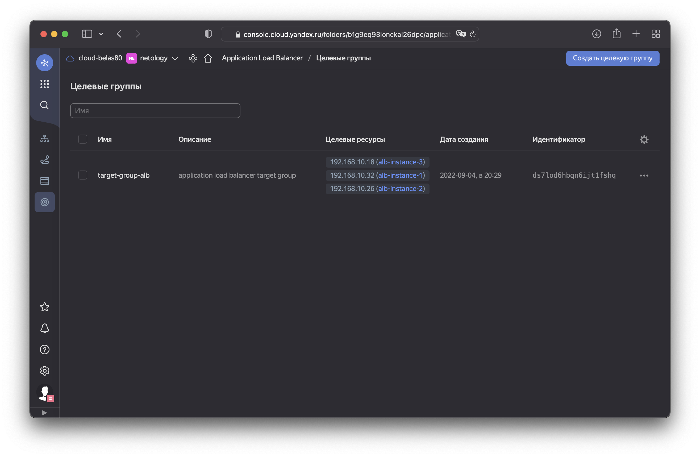
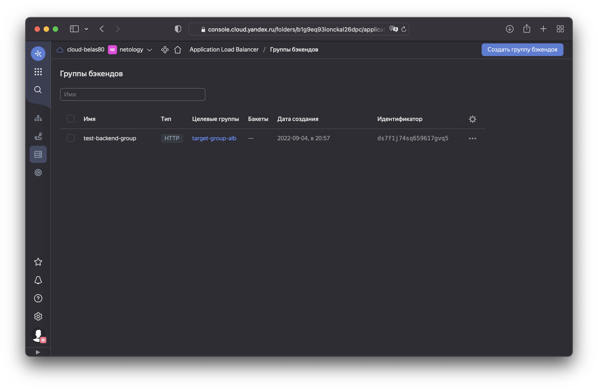
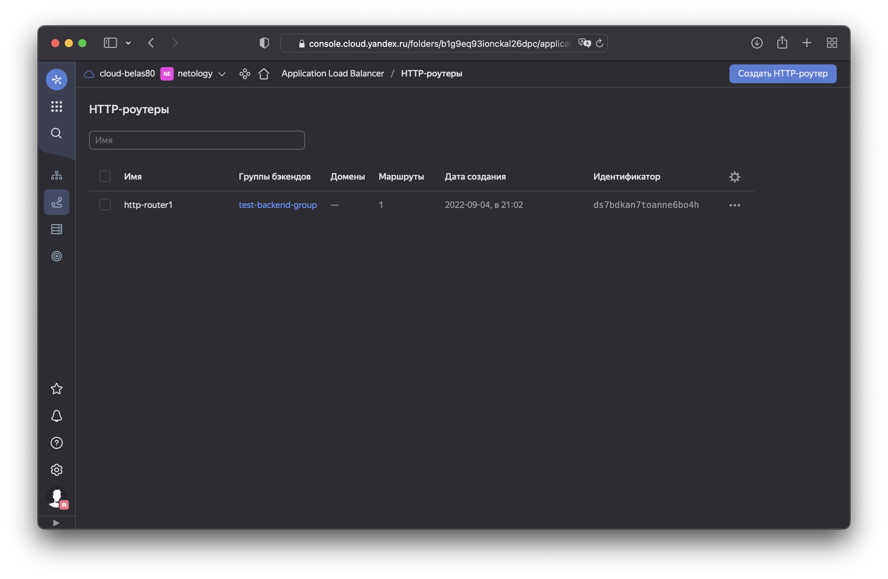
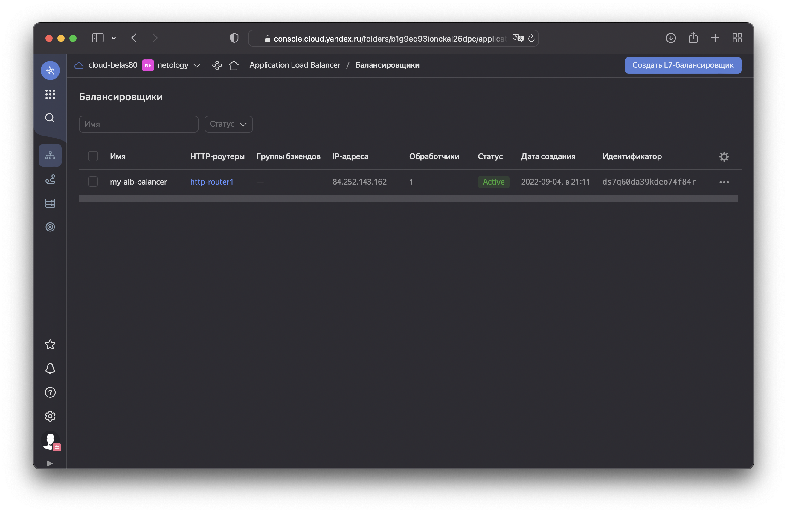
Потыкаем в браузере кнопку обновить.  
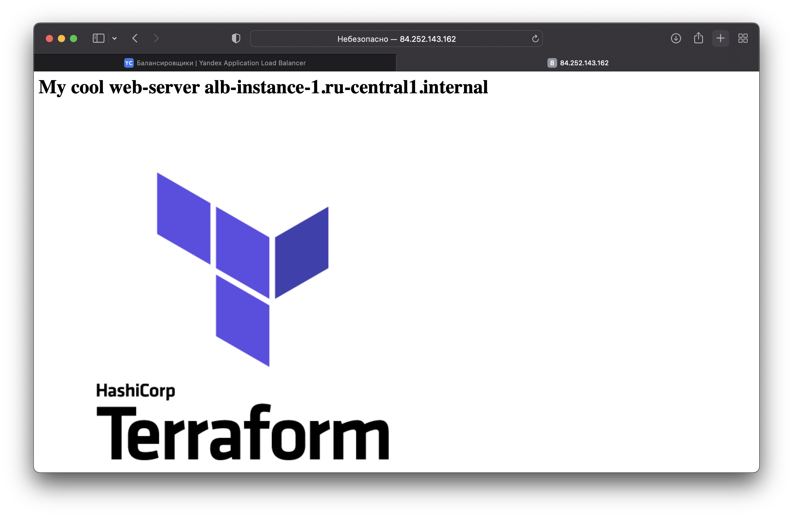
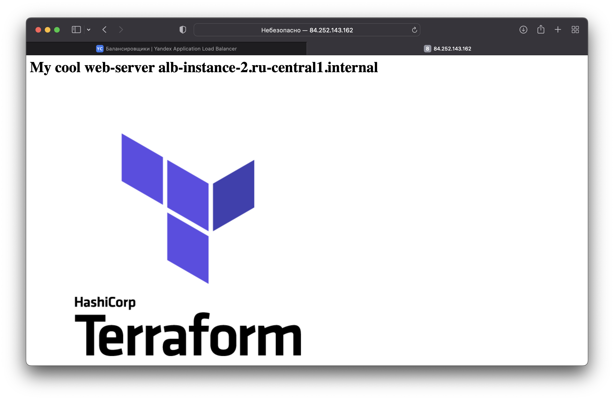

В заголовке видно что hostname меняется.  
