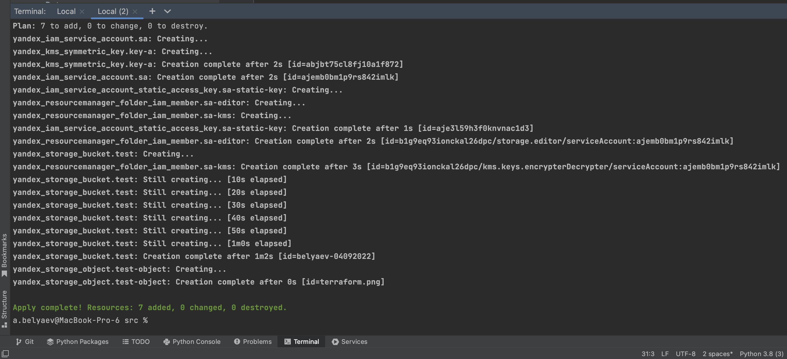
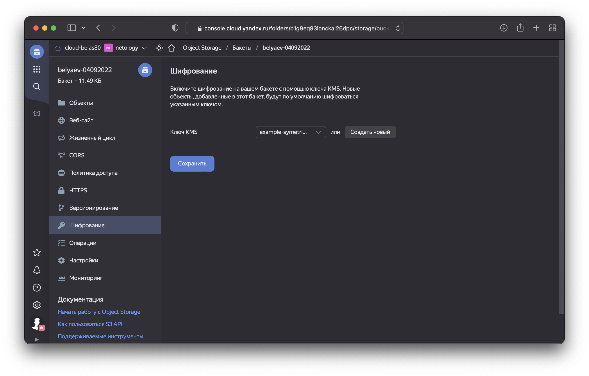
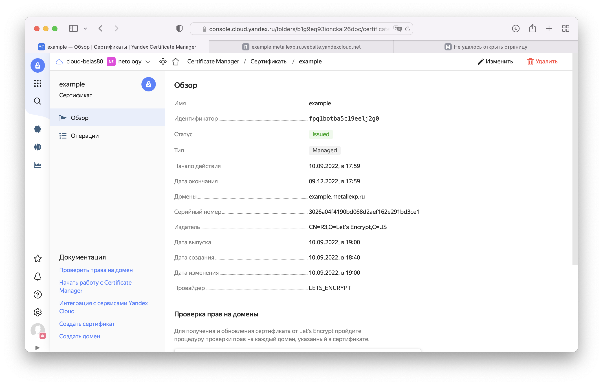
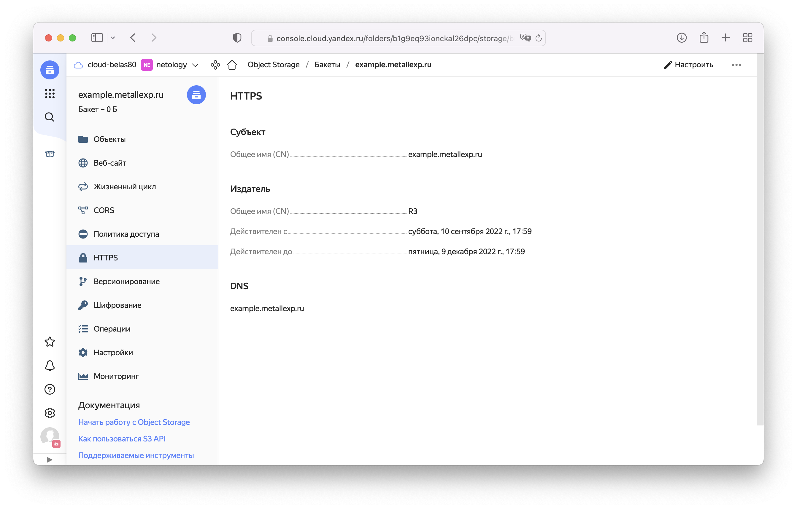
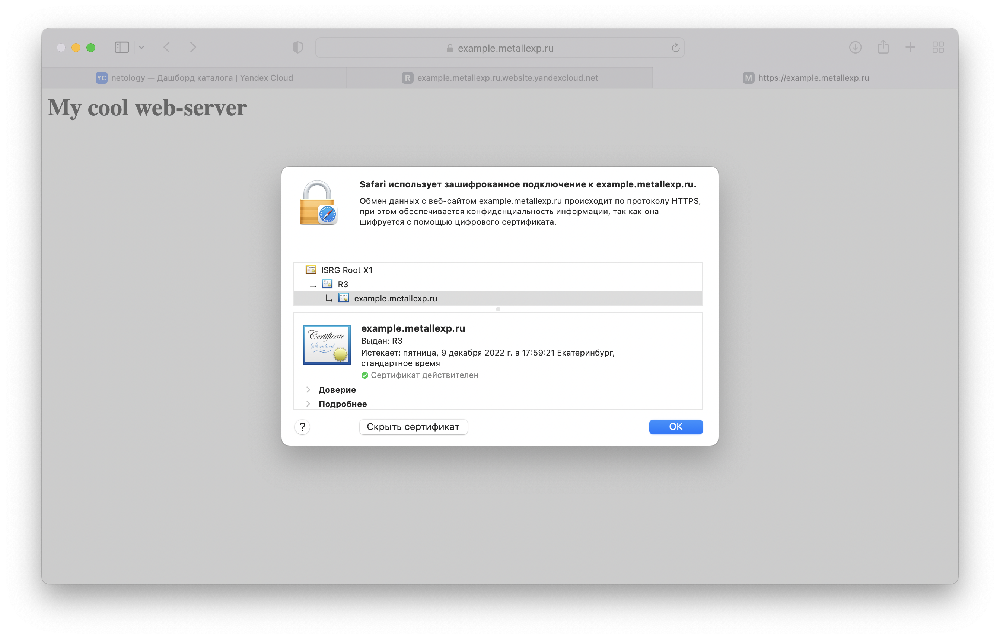

# 15.3 "Безопасность в облачных провайдерах"  

Используя конфигурации, выполненные в рамках предыдущих домашних заданиях, нужно добавить возможность шифрования бакета.  
Все исходники [здесь](src)

---
## Задание 1. Яндекс.Облако (обязательное к выполнению)
1. С помощью ключа в KMS необходимо зашифровать содержимое бакета:
- Создать ключ в KMS,  
  Для создания ключа используем следующий блок ([kms-key.tf](src/kms-key.tf)):
  ```terraform
  resource "yandex_kms_symmetric_key" "key-a" {
    name              = "example-symetric-key"
    description       = "description for key"
    default_algorithm = "AES_128"
    rotation_period   = "8760h" // equal to 1 year
  }
  ```
- С помощью ключа зашифровать содержимое бакета, созданного ранее.  
  Следующий блок добавит шифрования бакету, добавил [здесь](src/storage.tf#L32)  
  ```terraform
  server_side_encryption_configuration {
    rule {
      apply_server_side_encryption_by_default {
        kms_master_key_id = yandex_kms_symmetric_key.key-a.id
        sse_algorithm     = "aws:kms"
      }
    }
  }
  ```
  Для того чтобы сервисный аккаунт смог положить объект в бакет, нужно назначить ему роль `kms.keys.encrypterDecrypter` [здесь](src/storage.tf#L14)   
    
  

2. (Выполняется НЕ в terraform) *Создать статический сайт в Object Storage c собственным публичным адресом и сделать доступным по HTTPS
- Создать сертификат,  
  
- Создать статическую страницу в Object Storage и применить сертификат HTTPS,  
  
- В качестве результата предоставить скриншот на страницу с сертификатом в заголовке ("замочек").
  