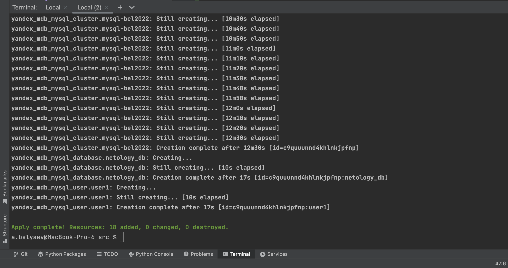
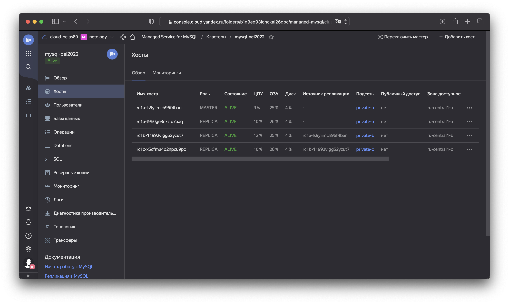
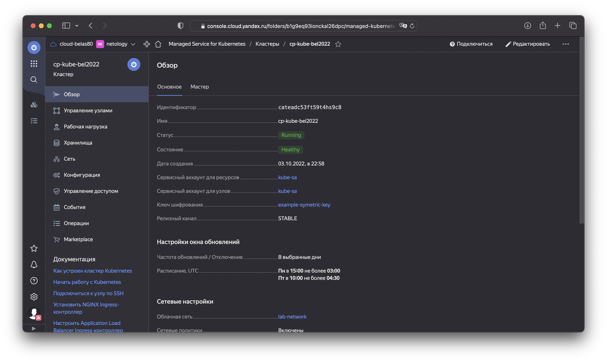
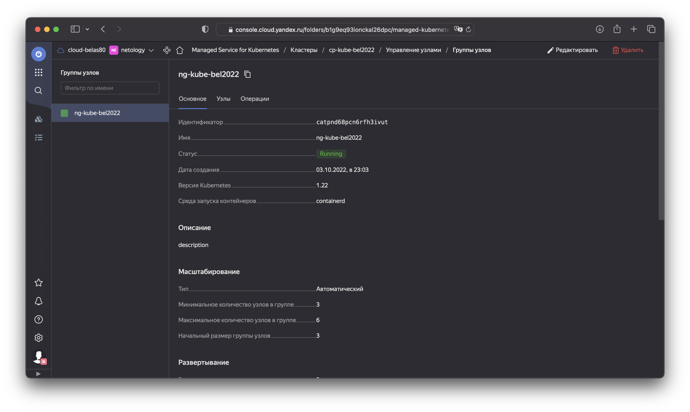
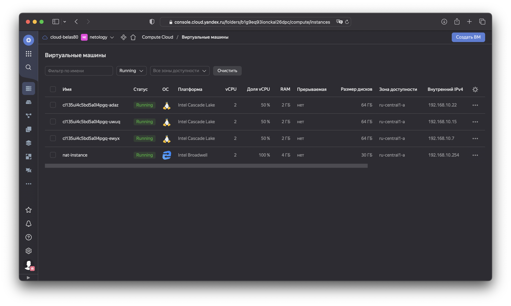
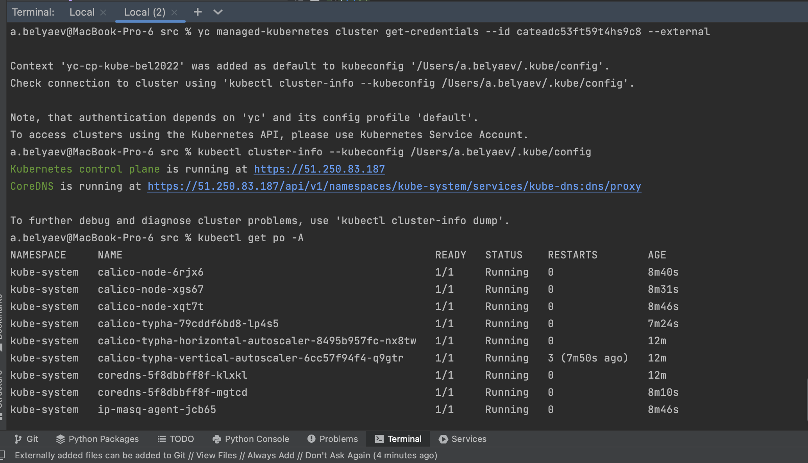
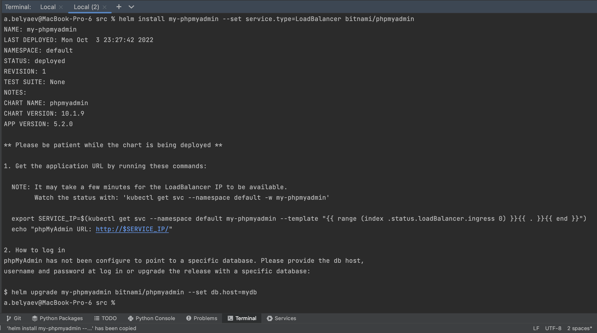
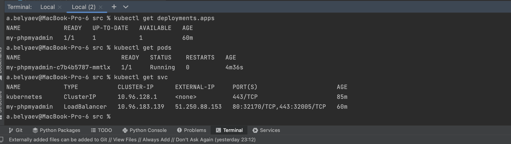
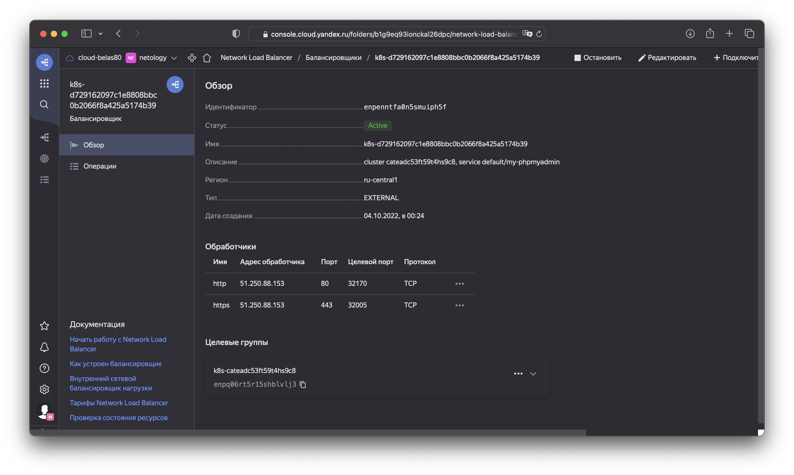
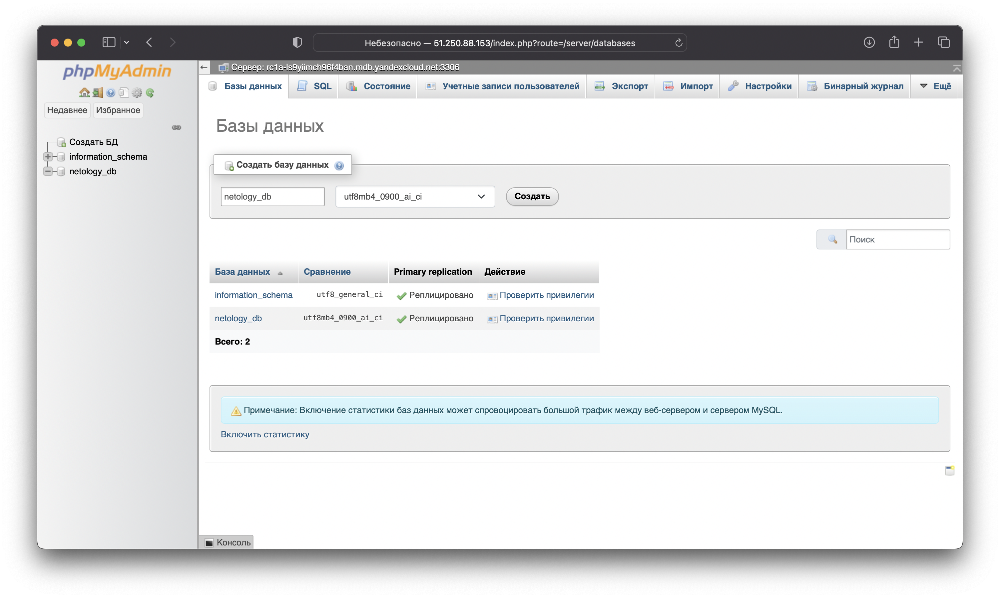

# 15.4 "Кластеры. Ресурсы под управлением облачных провайдеров"

Организация кластера Kubernetes и кластера баз данных MySQL в отказоустойчивой архитектуре.
Размещение в private подсетях кластера БД, а в public - кластера Kubernetes.

---
## Задание 1. Яндекс.Облако (обязательное к выполнению)

1. Настроить с помощью Terraform кластер баз данных MySQL:
- Используя настройки VPC с предыдущих ДЗ, добавить дополнительно подсеть private в разных зонах, чтобы обеспечить отказоустойчивость  
- Разместить ноды кластера MySQL в разных подсетях
- Необходимо предусмотреть репликацию с произвольным временем технического обслуживания
- Использовать окружение PRESTABLE, платформу Intel Broadwell с производительностью 50% CPU и размером диска 20 Гб
- Задать время начала резервного копирования - 23:59
- Включить защиту кластера от непреднамеренного удаления
- Создать БД с именем `netology_db` c логином и паролем  
  ####
  Настройки подсети private определены в файле [network.tf](src/network.tf#L41).  
  Две ноды размещено в зоне `a` и по одной ноде в зоне `b` и `c`. Нода в зоне `b` будет репликой с ноды в зоне `а`, а нода в зоне `c` репликой с ноды `b`.  
  Все настройки кластера MySQL, согластно требованиям выше, определены в одном файле [cluster-mysql.tf](src/cluster-mysql.tf)

2. Настроить с помощью Terraform кластер Kubernetes
- Используя настройки VPC с предыдущих ДЗ, добавить дополнительно 2 подсети public в разных зонах, чтобы обеспечить отказоустойчивость
- Создать отдельный сервис-аккаунт с необходимыми правами 
- Создать региональный мастер kubernetes с размещением нод в разных 3 подсетях
- Добавить возможность шифрования ключом из KMS, созданного в предыдущем ДЗ
- Создать группу узлов состояющую из 3 машин с автомасштабированием до 6
- Подключиться к кластеру с помощью `kubectl`
- *Запустить микросервис phpmyadmin и подключиться к БД, созданной ранее
- *Создать сервис типы Load Balancer и подключиться к phpmyadmin. Предоставить скриншот с публичным адресом и подключением к БД
  ####
  Настройки подсети public определены в файле [network.tf](src/network.tf#L17).  
  Cервис-аккаунт в файле [sa-kube.tf](src/sa-kube.tf).  
  Региональный мастер kubernetes определен в файле [cp-kube.tf](src/cp-kube.tf), шифрование ключем [kms-key.tf](src/kms-key.tf).  
  Группа узлов определена в файле [ng-kube.tf](src/ng-kube.tf).  
  Все исходники [здесь](src).  

### Результат:  

Выполнение `terraform apply`  
  
  
  
Проверим созданные ресурсы



  
Подлючение к кластеру, настроим конфик куба с помощью `yc`  
```shell
yc managed-kubernetes cluster get-credentials --id cateadc53ft59t4hs9c8 --external
```  
  
  
  
С помощью helm запустим микросервис phpmyadmin в нашем кластере k8s, сразу же укажем тип сервиса чтобы создать Load Balancer и подключится по публичному IP  
```shell
helm install my-phpmyadmin --set service.type=LoadBalancer bitnami/phpmyadmin
``` 
  
  
Проверим  
  
  

Наш балансировщик

Подключимся по внешнему айпи к нашей базе MySQL
